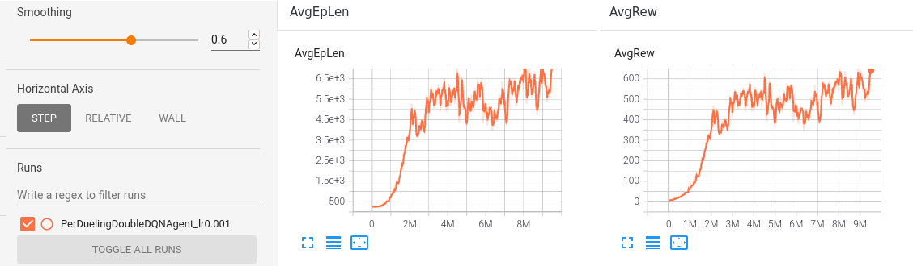

### frameworQ

A DQN framework for customized environments. Supports:  
- customized environments with openai gym.  
- Dynamic save and load with msgpack.  
- Multi-processing learning.  
- Tensorboard visualization.  

The following algorithms are implemented:  
- DQN: vanilla DQN.  
- DDQN: Double DQN.  
- 3DQN: Dueling Double DQN.  
- Per3DQN: Dueling Double DQN with Priority Experience Replay.  

How to use (e.g. cmd values here):  
1. Create a customized environment in `env/` and tune its hyperparameters in `env/dqn_config.py` (see `doc/`).  
2. Train the model with `python3 train.py -algo DuelingDoubleDQNAgent -max_total_steps 10000000`.  
3. Observe with `python3 observe.py -d save/DuelingDoubleDQNAgent_lr0.0001_model.pack`.  
4. Visualize the learning curves in tensorboard with `tensorboard --logdir ./logs/train/`.  
5. And beat the AI with `python3 play.py` to assert dominance on the machines.  

See `doc/` for a complete guide on how to use bin scripts, build a customized environment and run the programs.  
See `doc/custom_envs_w_frameworQ.txt` for implementations of customized environments with frameworkQ.  

****

### Build dependencies

make (venv): 3.a or `cd bin/ && bash make.sh`  
make (conda): 3.b

1. Apt packages:  
> apt-get update && apt-get install build-essential libpq-dev libssl-dev openssl libffi-dev sqlite3 libsqlite3-dev libbz2-dev zlib1g-dev cmake  

2. Python 3.7.m:  
> m=0 && while wget -q --method=HEAD https<area>://www<area>.python.org/ftp/python/3.7.$(( $m + 1 ))/Python-3.7.$(( $m + 1 )).tar.xz; do m=$(( $m + 1 )); done && wget https<area>://www<area>.python.org/ftp/python/3.7.$m/Python-3.7.$m.tar.xz && tar xvf Python-3.7.$m.tar.xz && cd Python-3.7.$m && ./configure && make && make altinstall && cd .. && rm -rv Python-3.7.$m.tar.xz Python-3.7.$m  

3. a. Venv (venv):  
> mkdir venv && python3.7 -m venv venv/  
> source venv/bin/activate  
> (venv) ... *Pip3 packages*  
> deactivate  

3. b. Venv (conda):  
> (base) conda create -n frameworQ python=3.7 anaconda  
> (base) conda activate frameworQ  
> (frameworQ) conda install -n frameworQ pip3  
> (frameworQ) ... *Pip3 packages*  
> (frameworQ) conda deactivate  
> (base) conda remove -n frameworQ --all  

4. Pip3 packages:  
> (...) export TMPDIR='/var/tmp'  
> (...) pip3 install 'pyglet==1.5.0' gym torch tensorboard 'msgpack==1.0.2' wheel --no-cache-dir  

****

### Customized environments with frameworQ

- flappy-seamonkai: https://github.com/romainducrocq/DQN-flappy-seamonkai

 

- initial-DQN: https://github.com/romainducrocq/DQN-initial-DQN

 

- DQN-ITSCwPD: https://github.com/romainducrocq/DQN-ITSCwPD

****

@romainducrocq
