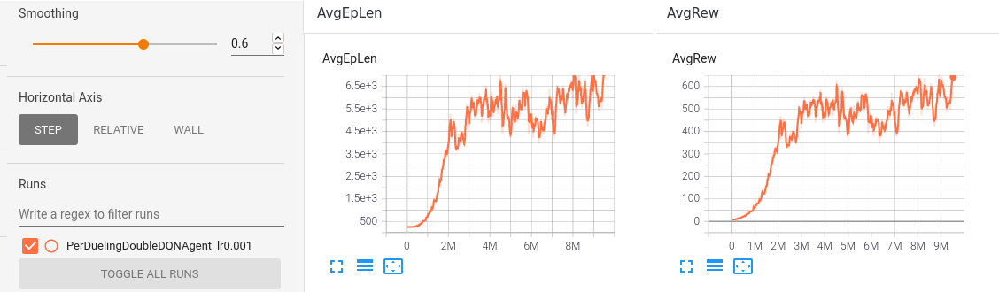
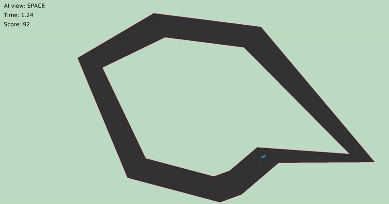
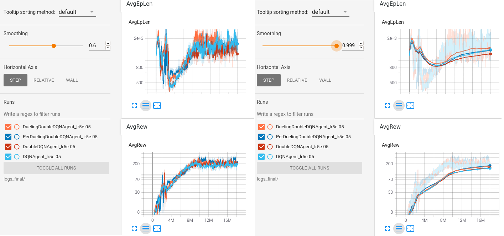

### frameworQ

A DQN framework for customized environments. Supports:  
- Customized environments with openai gym  
- Dynamic save and load with msgpack  
- Multi-processing learning  
- Tensorboard visualization  

The following algorithms are implemented:  
- DQN: (vanilla) DQN  
- DDQN: Double DQN  
- 3DQN: Dueling Double DQN  
- Per3DQN: Dueling Double DQN with Priority Experience Replay  

How to use (example values here):  
1. Create a customized environment in `env/` and tune its hyperparameters in `env/dqn_config.py` (see `doc/`)  
2. Train the model with `bin/train.sh -algo DuelingDoubleDQNAgent -max_total_steps 10000000`  
3. Observe with `bin/observe.sh -d save/DuelingDoubleDQNAgent_lr0.0001_model.pack`  
4. Visualize the learning curves in tensorboard with `bin/visualize.sh --logdir ./logs/train/`  
5. And beat the AI with `bin/play.sh` to assert dominance on the machines  

See `doc/` for a complete guide on how to use bin scripts, build a customized environment and run the programs.  
See `doc/custom_envs_w_frameworQ.txt` for implementations of customized environments with frameworkQ.  

****

### Build and Run

`cd bin/`

- Install with `sudo ./make.sh` or
```
cd ../

# Get dependencies

sudo apt-get update
sudo apt-get install build-essential libpq-dev libssl-dev openssl libffi-dev \
    sqlite3 libsqlite3-dev libbz2-dev zlib1g-dev g++ cmake

# Install Python 3.7.12 locally

if [ -f "Python-3.7.12.tar.xz" ]; then rm -v Python-3.7.12.tar.xz; fi
if [ -d "Python-3.7.12" ]; then rm -rv Python-3.7.12/; fi
wget https://www.python.org/ftp/python/3.7.12/Python-3.7.12.tar.xz
tar xvf Python-3.7.12.tar.xz
cd Python-3.7.12/
./configure
make
cd ../
rm -rv Python-3.7.12.tar.xz

# Make venv and install pip3 packages

if [ -d "venv" ]; then rm -rv venv/; fi
mkdir -v venv/
Python-3.7.12/python -m venv venv/
source venv/bin/activate
export TMPDIR='/var/tmp'
pip3 install six numpy 'pyglet==1.5.0' gym torch tensorboard 'msgpack==1.0.2' \
    wheel --no-cache-dir
deactivate
```
  
- Train an agent with `./train.sh [<args>]`
```
usage: train.sh [-h] [-gpu GPU] [-n_env N_ENV] [-lr LR] [-gamma GAMMA]
                [-eps_start EPS_START] [-eps_min EPS_MIN] [-eps_dec EPS_DEC]
                [-eps_dec_exp EPS_DEC_EXP] [-bs BS] [-min_mem MIN_MEM]
                [-max_mem MAX_MEM] [-target_update_freq TARGET_UPDATE_FREQ]
                [-target_soft_update TARGET_SOFT_UPDATE]
                [-target_soft_update_tau TARGET_SOFT_UPDATE_TAU]
                [-save_freq SAVE_FREQ] [-log_freq LOG_FREQ]
                [-save_dir SAVE_DIR] [-log_dir LOG_DIR] [-load LOAD]
                [-repeat REPEAT] [-max_episode_steps MAX_EPISODE_STEPS]
                [-max_total_steps MAX_TOTAL_STEPS] [-algo ALGO]

TRAIN

optional arguments:
  -h, --help            show this help message and exit
  -gpu GPU              GPU #
  -n_env N_ENV          Multi-processing environments
  -lr LR                Learning rate
  -gamma GAMMA          Discount factor
  -eps_start EPS_START  Epsilon start
  -eps_min EPS_MIN      Epsilon min
  -eps_dec EPS_DEC      Epsilon decay
  -eps_dec_exp EPS_DEC_EXP
                        Epsilon exponential decay
  -bs BS                Batch size
  -min_mem MIN_MEM      Replay memory buffer min size
  -max_mem MAX_MEM      Replay memory buffer max size
  -target_update_freq TARGET_UPDATE_FREQ
                        Target network update frequency
  -target_soft_update TARGET_SOFT_UPDATE
                        Target network soft update
  -target_soft_update_tau TARGET_SOFT_UPDATE_TAU
                        Target network soft update tau rate
  -save_freq SAVE_FREQ  Save frequency
  -log_freq LOG_FREQ    Log frequency
  -save_dir SAVE_DIR    Save directory
  -log_dir LOG_DIR      Log directory
  -load LOAD            Load model
  -repeat REPEAT        Steps repeat action
  -max_episode_steps MAX_EPISODE_STEPS
                        Episode step limit
  -max_total_steps MAX_TOTAL_STEPS
                        Max total training steps
  -algo ALGO            DQNAgent DoubleDQNAgent DuelingDoubleDQNAgent
                        PerDuelingDoubleDQNAgent
```
  
- Observe the trained agent with `./observe.sh [<args>]`
```
usage: observe.sh [-h] -d D [-gpu GPU] [-max_s MAX_S] [-max_e MAX_E]
                  [-log LOG] [-log_s LOG_S] [-log_dir LOG_DIR]

OBSERVE

optional arguments:
  -h, --help        show this help message and exit
  -d D              Directory
  -gpu GPU          GPU #
  -max_s MAX_S      Max steps per episode if > 0, else inf
  -max_e MAX_E      Max episodes if > 0, else inf
  -log LOG          Log csv to ./logs/test/
  -log_s LOG_S      Log step if > 0, else episode
  -log_dir LOG_DIR  Log directory
```
  
- Visualize training boards with `./visualize.sh [<args>]`
```
usage: visualize.sh [-h] [--logdir PATH]

VISUALIZE
optional arguments:
  -h, --help        show this help message and exit
  --logdir PATH     Directory where TensorBoard will look to find
                    structure rooted at logdir, looking for .*tfevents.*
```
  
- Play the game yourself with `./play.sh [<args>]`
```
usage: play.sh [-h] [-max_s MAX_S] [-max_e MAX_E] [-log LOG] [-log_s LOG_S]
               [-log_dir LOG_DIR] [-player PLAYER]

PLAY

optional arguments:
  -h, --help        show this help message and exit
  -max_s MAX_S      Max steps per episode if > 0, else inf
  -max_e MAX_E      Max episodes if > 0, else inf
  -log LOG          Log csv to ./logs/test/
  -log_s LOG_S      Log step if > 0, else episode
  -log_dir LOG_DIR  Log directory
  -player PLAYER    Player
```

****

### Customized environments with frameworQ

- DQN-FlappyBird: https://github.com/romainducrocq/DQN-FlappyBird




<br>

- DQN-initial-d: https://github.com/romainducrocq/DQN-initial-d





<br>

- DQN-ITSCwPD: https://github.com/romainducrocq/DQN-ITSCwPD


****

@romainducrocq
